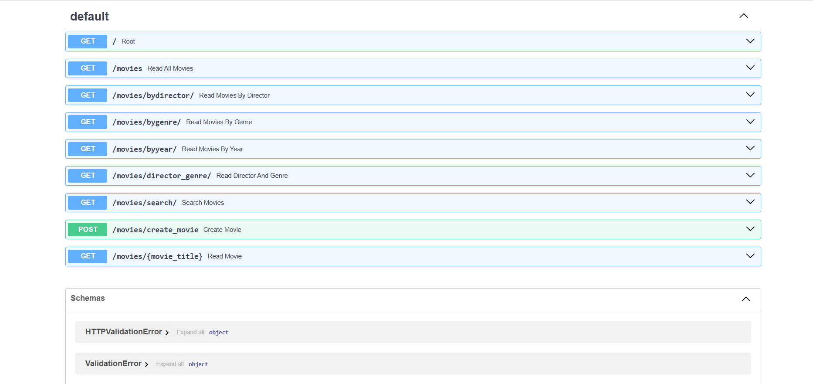

# 🎬 Movie API

A RESTful API built with FastAPI for managing a movie collection. Features complete CRUD operations, advanced filtering, search functionality, and proper error handling.

## Technologies

- Python 3.8+
- FastAPI
- Uvicorn

## 📦 Installation

1. **Clone the repository**
```bash
git clone https://github.com/ChiragO9/Movie-API-.git
cd Movie-API-
```

2. **Create and activate virtual environment**
```bash
# Create virtual environment
python -m venv fastapienv

# Activate on Windows
fastapienv\Scripts\activate

# Activate on Mac/Linux
source fastapienv/bin/activate
```

3. **Install dependencies**
```bash
pip install fastapi uvicorn
```

## Running the API
```bash
uvicorn main:app --reload
```

The API will be available at `http://127.0.0.1:8000`

**Interactive Documentation:** `http://127.0.0.1:8000/docs`

## Screenshots

### Interactive API Documentation



## API Endpoints

### Root
- **`GET /`**
  - Returns welcome message
  - **Response:** `{"message": "Welcome to the Movie API"}`

### Get All Movies
- **`GET /movies`**
  - Returns all movies in the database
  - **Response:** Array of movie objects

### Get Movie by Title
- **`GET /movies/{movie_title}`**
  - Get a specific movie by title (case-insensitive)
  - **Example:** `/movies/inception`
  - **Response:** Single movie object or 404 error

### Filter by Director
- **`GET /movies/bydirector/?director={name}`**
  - Filter movies by director name (case-insensitive)
  - **Example:** `/movies/bydirector/?director=Christopher Nolan`
  - **Response:** Array of matching movies or 404 error

### Filter by Genre
- **`GET /movies/bygenre/?genre={genre}`**
  - Filter movies by genre (case-insensitive)
  - **Example:** `/movies/bygenre/?genre=sci-fi`
  - **Response:** Array of matching movies or 404 error

### Filter by Year
- **`GET /movies/byyear/?year={year}`**
  - Filter movies by release year
  - **Example:** `/movies/byyear/?year=2010`
  - **Response:** Array of matching movies or 404 error

### Filter by Director AND Genre
- **`GET /movies/director_genre/?director={name}&genre={genre}`**
  - Filter movies by both director and genre (case-insensitive)
  - **Example:** `/movies/director_genre/?director=Christopher Nolan&genre=sci-fi`
  - **Response:** Array of matching movies or 404 error

### Search Movies
- **`GET /movies/search/?q={query}`**
  - Search across title, director, and genre (case-insensitive)
  - **Example:** `/movies/search/?q=nolan`
  - **Response:** Array of matching movies or 404 error
  - **Note:** Returns 400 error if search query is empty

### Create Movie
- **`POST /movies/create_movie`**
  - Add a new movie to the database
  - **Request Body:**
```json
    {
      "title": "Movie Title",
      "director": "Director Name",
      "genre": "Genre",
      "year": 2024
    }
```
  - **Response:** Success message with created movie object
  - **Validation:** 
    - All fields (title, director, genre, year) are required (400 error if missing)
    - Movie title must be unique (400 error if duplicate)

##  Response Format

All endpoints return JSON. Movie objects contain:
- `title` (string) - Movie title
- `director` (string) - Director name
- `genre` (string) - Movie genre
- `year` (integer) - Release year

**Example Movie Object:**
```json
{
  "title": "Inception",
  "director": "Christopher Nolan",
  "genre": "sci-fi",
  "year": 2010
}
```

## Error Responses

- **404 Not Found** - Returned when no movies match the query or movie doesn't exist
- **400 Bad Request** - Returned for:
  - Missing required fields in POST request
  - Duplicate movie title
  - Empty search query

**Error Response Format:**
```json
{
  "detail": "Error message describing the issue"
}
```

## Sample Movie Database

The API comes pre-loaded with 9 movies including:
- Inception (2010) - Christopher Nolan
- The Dark Knight (2008) - Christopher Nolan
- Interstellar (2014) - Christopher Nolan
- Titanic (1997) - James Cameron
- Forrest Gump (1994) - Robert Zemeckis
- Gladiator (2000) - Ridley Scott
- The Godfather (1972) - Francis Ford Coppola
- Parasite (2019) - Bong Joon-ho
- La La Land (2016) - Damien Chazelle

## Author

**Chirag**
- GitHub: [@ChiragO9](https://github.com/ChiragO9)

---

**Note:** This API uses in-memory storage. All data will be reset when the server restarts.
